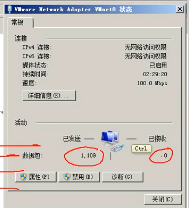
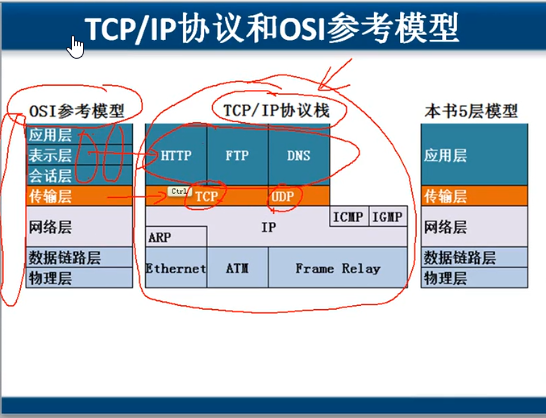
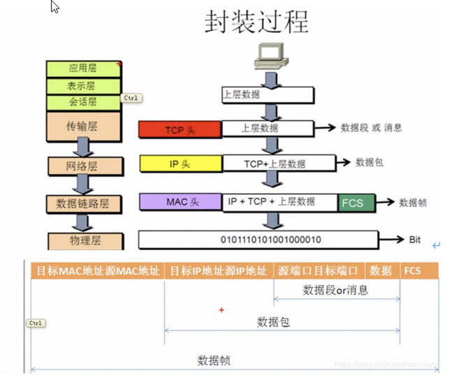
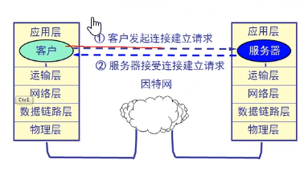
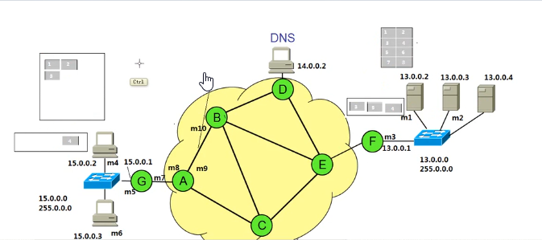

# 
第一章 计算机网络概述

 >1. 计算机网络OSI七层模型

    应用层：所有能产生网络流量的程序
    表示层：在传输之前是否进行压缩或者加密处理，二进制ASCII 纠错
    会话层：查木马 netstat -n 提供建立和使用链接的方法
    传输层：可靠传输 流量控制 不可靠传输
    网络层：负责选择最佳路径 规划IP地址
    数据链路层：定义帧的开始和结束 透明传输 差错校验  查错
    物理层：网络设备的接口标准 电器标准 如何在物理链路上传输更快的速度

注意：分析网络问题，尽可能按层分析。各层之间不会相互影响

 >2. OSI参考模型和网络排错

        1.物理层故障 查看连接状态 查看发送和接收的数据包

        2. 数据链路层故障  Mac地址冲突 ADSL欠费 网络没办法协商 计算机连接到错误的VLAN
        3.网络层故障 配置错误IP地址 子网掩码 配置错误网关地址 路由器没有配置到达目标网路的路由
        4.应用层故障 应用程序配置错误

 >3. OSI参考模型和网络安全

        1.物理层网络安全    别人可以随意接入我的网络
        2.数据链路层网络安全 ADSL 账号密码 无线AP vlan 交换机端口绑定MAC地址
        3.网络层安全 在路由器上使用ACL控制数据包流量 windows防火墙
        4. 应用层安全 开发的应用程序没有漏洞

>4. OSI参考模型和TCP/IP 协议

>封装过程

>5 计算机网络的性能：

        1. 速率，连接在计算机网络上的主机在数字信道上传送数据位数的速率，也称data rate或bit rate(比特率)，单位是b/s, kb/s, Mb/s, Gb/s。和正常理解的网速的关系是除以8.
        2. 带宽，数据通信领域中，数字信道所能传送的最高数据率，单位是b/s, kb/s, Mb/s, Gb/s。常见的是Mpbs。
        3. 吞吐量，在单位时间内通过某个网络的数据量，单位是b/s, Mb/s。
        4. 时延，包括发送时延，传播时延，处理时延，排队时延。发送时延等于数据块长度(bit)除以信道带宽(bit/s). 更快的发送速度意味着波长越短，链路上的数据量更大；更快的传播速度意味着在网线中更快的传播速度。
        5. 时延X带宽(时延带宽积)，有多少数据正在线路上。
        6. 往返时间(RTT, Round-Trip Time)，从发送方发送数据开始，到发送方收到接收方确认数据的时间。例如ping一下。
        7. 利用率，包括信道利用率：有数据通过的时间/总时间
        网络利用率：信道利用率的加权平均
        网络当前时延D = 网络空闲时时延D0 / (1 - 信道利用率U)
